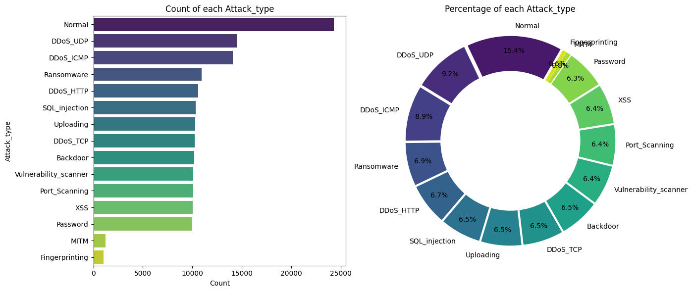
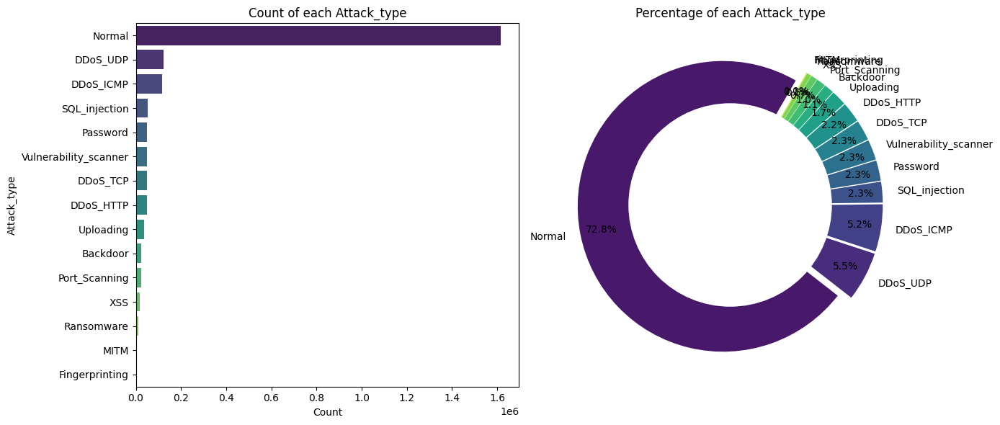
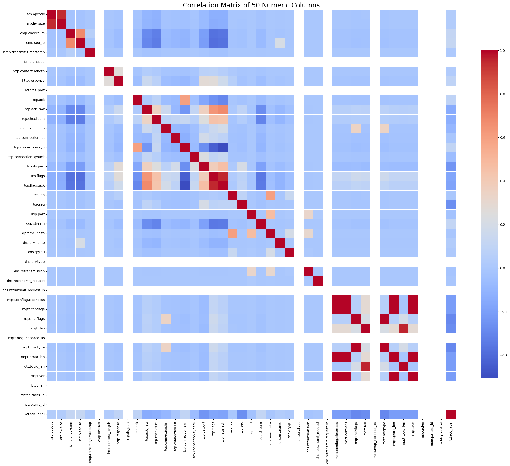
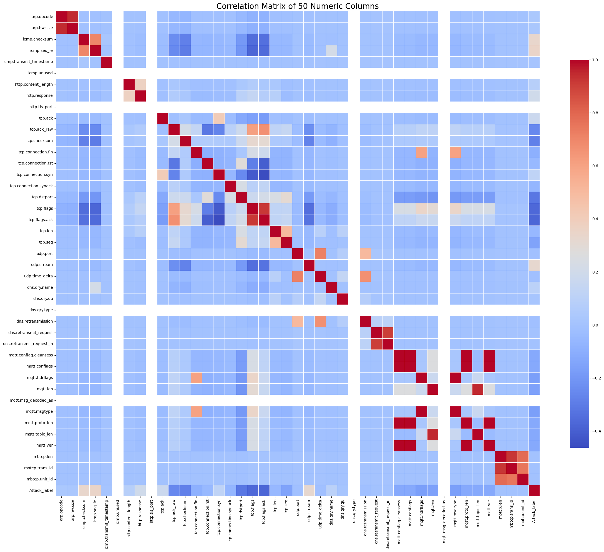

# Preliminary Analysis — Edge IIoTset Dataset

This document covers the exploratory data analysis (EDA) and column-level cleaning decisions applied to the Edge IIoTset dataset prior to any modeling. Source notebooks: [`01_EDA.ipynb`](../notebooks/EdgeIIoT/01_EDA.ipynb) and [`02_Cleaning.ipynb`](../notebooks/EdgeIIoT/02_Cleaning.ipynb).

---

## 1 - Dataset Overview

The Edge IIoTset dataset is provided in two variants optimized for different model architectures:

| Variant | Rows | Columns | Notes |
|---|---|---|---|
| ML-optimized | 157,800 | 63 | Used in all ML experiments |
| DL-optimized | 2,219,201 | 63 | Larger set for deep learning |

Both variants share the same 63-column schema. Each contains 50 numeric columns and 13 non-numeric columns, with no null values.

The data consists of network packet captures generated in a controlled IIoT lab environment. Each row corresponds to one captured packet and is labeled with an attack type (`Attack_type`) and a binary label (`Attack_label`).

---

## 2 - Class Distribution

The dataset contains 14 classes: `Normal` traffic plus 13 distinct attack types. The distribution is **severely imbalanced**:

- `Normal` traffic is the dominant class by a large margin.
- Attack types present: `DDoS_UDP`, `DDoS_ICMP`, `Ransomware`, `DDoS_HTTP`, `SQL_Injection`, `Uploading`, `DDoS_TCP`, `Backdoor`, `Vulnerability_scanner`, `Port_Scanning`, `XSS`, `Password`, `MITM` and `Fingerprinting`.

This class imbalance has a direct consequence for model evaluation: **accuracy is a misleading metric** because a model that predicts `Normal` for every packet would still achieve high accuracy. All hyperparameter tuning in this project uses `f1_weighted` as the scoring metric to account for this imbalance.

---

## 3 - Correlation Analysis

The correlation matrix below covers all 50 numeric columns of the raw ML dataset before any cleaning is applied.

### 3.1 - Redundancy Clusters Identified

The following highly correlated features were identified:
- `arp.opcode` and `arp.hw.size`
- `tcp.flags` and `tcp.flags.ack`
- `mqtt.conflag.cleansess`, `mqtt.conflags`, `mqtt.proto_len` and `mqtt.ver`
- `mqtt.hdrflags` and `mqttt.msgtype`
- `mqtt.len` and `mqtt.topic_len`

All high-correlation redundancies visible in the EDA correlation matrix are resolved by the cleaning step documented in Section 4 below. 

---

## 4 - Data Cleaning — Column-Level Decisions

The cleaning procedures described below are applicable to both Binary and Multiclass classification tasks. Note that specific features may be selectively enabled or disabled depending on the classification objective and restrictions.

In this study, "Cleaning" includes basic feature transformations that can be performed during the initial packet capture (PCAP) extraction or via simple logic. Complex, model-dependent transformations (such as scaling, normalization, or advanced encoding) are reserved for the Preprocessing phase.

The cleaning logic is informed by the following Kaggle notebooks:
- [Edge-IIoTset Pre-Processing](https://www.kaggle.com/code/mohamedamineferrag/edge-iiotset-pre-processing) by Mohamed Amine Ferrag
- [Predict Attack and Attack Type](https://www.kaggle.com/code/waleedgul/predict-attack-and-attack-type#Irrelevant-Columns-for-IoT-Attack-Detection) by Waleed Gul

---

### 4.01 - Frame

#### 4.01.01 - `frame.time`
- **Definition:** Logs the precise arrival timestamp of the network packet at the Frame layer.
- **Treatment:** Transformed.
- **Reason:** Timing alone doesn't indicate malicious behavior but order and difference does (DoS Attacks).

---

### 4.02 - IP (Internet Protocol)

#### 4.02.01 - `ip.src_host` and `ip.dst_host`

- **Definition**: Source and destination IPv4 addresses of the packet.
- **Treatment**: Transformed.
- **Reason**: To prevent the model from memorizing environment-specific addresses it is transformed into `Public`, `Private` or `Reserved`.

---

### 4.03 - ARP (Address Resolution Protocol)

#### 4.03.01 - `arp.src.proto_ipv4` and `arp.dst.proto_ipv4`

- **Definition**: Represents the sender and target IPv4 addresses within the ARP header.
- **Treatment**: Dropped.
- **Reason**: Removal prevents the model from memorizing environment-specific addresses.

#### 4.03.02 - `arp.hw.size`

- **Definition**: Specifies the length (in bytes) of the hardware address.
- **Treatment**: Dropped.
- **Reason**: Redundancy and zero variance. The value remains constant (`6`) for all valid ARP packets, resulting in high collinearity with arp.opcode.

#### 4.03.03 - `arp.opcode`

- **Definition**: Type of ARP message (`0` = No ARP, `1` = ARP Request or `2` = ARP Reply).
- **Treatment**: Retained / Binarization. Transformed into two binary features: `arp.opcode_request` and `arp.opcode_reply`.
- **Reason**: The opcode is a nominal categorical variable, not an ordinal one.

> [!NOTE]
>
> Non-ARP packets (original value 0) result in both new binary features being set to 0.

---

### 4.04 - ICMP (Internet Control Message Protocol)

#### 4.04.01 - `icmp.checksum`

- **Definition**: A 16-bit field used for error-checking the ICMP header and data to ensure integrity.
- **Treatment**: Dropped.
- **Reason:** Checksums are transient values computed dynamically per packet.

#### 4.04.02 - `icmp.seq_le`

- **Definition**: The Sequence Number (Little Endian) used to pair Echo Requests with corresponding Echo Replies.
- **Treatment**: Retained
- **Reason:** Discontinuities, high-frequency increments, or non-sequential jumps in sequence numbers are primary indicators of ICMP flooding (DoS) or data exfiltration via covert tunneling.

#### 4.04.03 - `icmp.transmit_timestamp`

- **Definition**: A timestamp indicating when the sender last interacted with the message before transmission.
- **Treatment**: Dropped.
- **Reason:** Timing synchronization data is highly host-specific. ML models will model only spacial features.

#### 4.04.04 - `icmp.unused`

- **Definition**: A 4-byte reserved field that is mandated to be set to zero in specific ICMP message types.
- **Treatment**: Dropped.
- **Reason:** By definition, this field contains no information. This column is constant to `0.`.

---

### 4.05 - HTTP (HyperText Transfer Protocol)

#### 4.05.01 - `http.file_data`

- **Definition**: The actual body content or payload transmitted within an HTTP entity.
- **Treatment**: Retained / Replaced `'0.0'` and `'0'` to `''`
- **Reason:** Although computationally expensive, could be an essential feature for multiclass clasification. We can try extracting the observed size to detect buffer overflow attacks.

#### 4.05.02 - `http.content_length`

- **Definition**: The size of the entity-body, in decimal number of octets, sent to the recipient.
- **Treatment**: Retained
- **Reason:** Large discrepancies between content_length and actual observed bytes can indicate data exfiltration or buffer overflow attempts.

> [!NOTE]
>
> High Standard Desviation is observed.

#### 4.05.03 - `http.request.uri.query`

- **Definition**: The query string portion of the URI (e.g., everything after the ?).
- **Treatment**: Retained / Replaced `'0.0'` and `'0'` to `''`
- **Reason:** Essential to detect SQL injection or XSS patterns. The raw string is too high-cardinality for direct use.

#### 4.05.04 - `http.request.method`

- **Definition**: The HTTP verb used (GET, POST, PUT, DELETE, etc.).
- **Treatment**: Binarization. Transformed into the binary features: `method_get`, `method_head`, `method_post`, `method_put`, `method_delete`, `method_connect`, `method_options`, `method_trace` and `method_patch`.
- **Reason:** Methods are nominal categories. Identifying "POST" vs "GET" is essential, as certain attacks (like credential stuffing) are almost exclusively performed via POST requests.

> [!NOTE]
>
> Although some methods are not present in the dataset, they are included for latter real-world testing.

#### 4.05.05 - `http.referer`

- **Definition**: Identifies the address of the webpage that linked to the requested resource.
- **Treatment**: Retained / Replaced `'0.0'` and `'0'` to `''`
- **Reason:** Critical indicator of a Remote Code Execution attack (such as `() { _; } >_[$($())] { echo 93e4r0... }`).

#### 4.05.06 - `http.request.full_uri`

- **Definition**: The complete URI string, encompassing the scheme, host/domain, and path.
- **Treatment**: Dropped / Feature Extraction (Path Only).
- **Reason:** The query component is already captured in `http.request.uri.query`, and hostnames vary inconsistently across different environments. Only the path component is retained or extracted, as it typically contains the target endpoint and potential attack vectors.

#### 4.05.07 - `http.request.version`

- **Definition**: The version of the HTTP protocol used (e.g., HTTP/1.1, HTTP/2).
- **Treatment**: Retained
- **Reason:** Anomalous or outdated versions can be an indicator of an attack.

#### 4.05.08 - `http.response`

- **Definition**: A binary flag (`0` or `1`) indicating whether the packet is a response.
- **Treatment**: Retained.
- **Reason:** Asymmetrical request-response flows can be an indicator of DoS attacks.

#### 4.05.09 - `http.tls_port`

- **Definition**: The port number used if the HTTP traffic is encapsulated in TLS (HTTPS).
- **Treatment**: Retained
- **Reason:** Non-standard TLS ports are frequently used by malware for Command and Control (C2) communication to bypass basic firewall filters.

> [!NOTE]
>
> In this case the value is constant to `0` as there are no encrypted HTTPS traffic. Retained for structural integrity.

---

### 4.06 - TCP (Transmission Control Protocol)

#### 4.06.01 - `tcp.ack` (Relative)

- **Definition**: A 32-bit field that indicates the next sequence number the sender of the segment expects to receive.
- **Treatment**: Retained
- **Reason:** Helps detecting anomalies in communication flows.

> [!NOTE]
>
> "Relative," means that it starts at 1 for each new connection to simplify tracking.

#### 4.06.02 - `tcp.ack_raw`

- **Definition**: The actual 32-bit acknowledgment number contained in the TCP header, representing the absolute value of the next byte expected.
- **Treatment**: Dropped
- **Reason:** It provides redundant information when tcp.ack (relative) is already present.

#### 4.06.03 - `tcp.checksum`

- **Definition**: A 16-bit field in the TCP header used for error-checking to ensure the integrity of the segment's header and data during transmission.
- **Treatment**: Transformed.
- **Reason:** Transient value that varies with every change in the payload or header. New column `tcp.nullchecksum` that indicates if the checksum is `0`.

#### 4.06.04 - `tcp.dstport` and `tcp.srcport`

- **Definition**: The source and destination ports.
- **Treatment**: Dropped
- **Reason:** Prevents the model from overfitting to specific network configurations or service assignments.

#### 4.06.05 - `tcp.flags`

- **Definition**: TCP control bits.
- **Treatment**: Binarized.
- **Reason:** Critial for detecting DoS/DDoS attacks, such as TCP SYN Floods.

#### 4.06.06 - `tcp.connection.fin`, `tcp.connection.rst`, `tcp.connection.syn`, `tcp.connection.synack`, `tcp.flags.ack`

- **Definition**: TCP control bits.
- **Treatment**: Dropped.
- **Reason:** Redundant.

> [!NOTE]
>
>  The column `tcp.connection.syn` does not perfectly correlate to new `tcp.flag.syn` because the first is not the bit control itself but the condition `SYN = 1 AND ACK = 0`.

#### 4.06.07 - `tcp.len`

- **Definition**: A field that indicates the size of the TCP segment data (payload) in bytes, excluding the TCP header.
- **Treatment**: Retained.
- **Reason:** Used to detect volumetric attacks. Sudden changes in packet size or a high frequency of identical lengths are indicators of DoS/DDoS flooding.

#### 4.06.08 - `tcp.options`

- **Definition**: Optional parameters in the TCP header.
- **Treatment**: Dropped.
- **Reason:** These are low-level TCP configuration details that generally add noise rather than useful signals for detection.

#### 4.06.09 - `tcp.payload`

- **Definition**: The actual data content carried by the TCP segment.
- **Treatment**: Dropped.
- **Reason:** The authors of the dataset explicitly recommend dropping payload information to ensure privacy and focus on statistical network behavior.

#### 4.06.10 - `tcp.seq`

- **Definition**: A 32-bit numerical value assigned to the first byte of data in a segment.
- **Treatment**: Retained.
- **Reason:** Manipulations or high values are indicators of sequence-based and flooding attacks.

---

### 4.07 - UDP (User Datagram Protocol)

#### 4.07.01 - `udp.port`

- **Definition**: A numerical identifier (16-bit) used to distinguish between different services or processes communicating via the User Datagram Protocol.
- **Treatment**: Dropped.
- **Reason:** Similar to TCP ports. Removed to prevent model from overfitting.

#### 4.07.02 - `udp.stream`

- **Definition**: An index that groups related UDP packets belonging to the same flow between two endpoints.
- **Treatment**: Retained.
- **Reason:** Allows to track the consistency of a data flow.

#### 4.07.03 - `udp.time_delta`

- **Definition**: The time difference (offset) between the current frame and the previous frame in a specific UDP stream.
- **Treatment**: Retained.
- **Reason:** Sudden decreases in the time delta indicates a high-frequency packet injection (UDP Flood DDoS attacks).

---

### 4.08 - DNS (Domain Name System)

#### 4.08.01 - `dns.qry.name`, `dns.qry.name.len`, `dns.qry.qu` and, `dns.qry.type`

- **Definition**: The domain name being resolved into an IP address and its length. A boolean flag indicating a "QU" (unicast) question and a field specifying the type of DNS record requested.
- **Treatment**: Dropped.
- **Reason:** Misalignment during the feature extraction from raw PCAP files to CSV format.

#### 4.08.02 - `dns.retransmission`

- **Definition**: Indicates if a DNS packet is a repeated transmission of a previous packet.
- **Treatment**: Retained.
- **Reason:** All entries with the flag set to `0` are not an attack.

#### 4.08.03 - `dns.retransmit_request`

- **Definition**: A binary flag indicating whether the packet is specifically a retransmitted query (request)
- **Treatment**: Retained.
- **Reason:** All values set to `1` are not an attack.

#### 4.08.04 - `dns.retransmit_request_in`

- **Definition**: Contains the frame number of the original request that this packet is retransmitting.
- **Treatment**: Retained.
- **Reason:** All values set to `0` are not attacks.

---

### 4.09 - MQTT (Message Queuing Telemetry Transport)

#### 4.09.01 - `mqtt.conack.flags`

- **Definition**: A hexadecimal or integer value representing the "Connect Acknowledgment" flags sent by the broker in response to a connection request.
- **Treatment**: Retained. Regularized to integer.
- **Reason:** Provides information about the MQTT connection flow. No attack has any of this flags set to `1`.

#### 4.09.02 - `mqtt.conflag.cleansess`

- **Definition**: A Boolean indicator that specifies whether the client and broker should discard previous session data and start a "clean" session.
- **Treatment**: Retained.
- **Reason:** Frequent "clean session" requests can be used in DoS attacks to force the broker to constantly reallocate resources.

#### 4.09.03 - `mqtt.conflags`

- **Definition**: A composite field containing various flags from the MQTT CONNECT packet, such as Will Flag, Will QoS, and Will Retain.
- **Treatment**: Dropped.
- **Reason:** The only flag set is the Clean Session Flag which is already present in `mqtt.conflag.cleansess` colunm.

#### 4.09.04 - `mqtt.len`

- **Definition**: Numerical value representing the total length of the MQTT message payload.
- **Treatment**: Retained.
- **Reason:** Large or unexpected payload sizes are strong indicators of data exfiltration or buffer overflow attempts within Injection attacks.

#### 4.09.05 - `mqtt.msg_decoded_as`

- **Definition**: A descriptive string identifying the format or structure into which the MQTT message payload was decoded.
- **Treatment**: Dropped.
- **Reason:** Constant to `0`. Provides no information.

#### 4.09.06 - `mqtt.msg`

- **Definition**: The raw content or sequence of bytes contained within the MQTT message payload
- **Treatment**: Retained / Replaced `'0.0'` and `'0'` to `''`
- **Reason:** Allows to detect Injection attacks carried inside the content of the MQTT payload.

#### 4.09.07 - `mqtt.msgtype`

- **Definition**: An integer code identifying the type of MQTT control packet (e.g., 1 for CONNECT, 3 for PUBLISH).
- **Treatment**: Binarization.
- **Reason:** Critical for identifying protocol violations. A high frequency of CONNECT packets without subsequent PUBLISH actions may indicate a DoS attack.

#### 4.09.08 - `mqtt.hdrflags`

- **Definition**: An integer representation of the 8-bit fixed header byte. This byte is divided into two 4-bit sections: the Message Type (bits 7-4) and Specific Flags (bits 3-0) such as DUP (duplicate delivery), QoS (Quality of Service levels), and RETAIN.
- **Treatment**: Dropped.
- **Reason:** Only the msg type bits are set. Information already present in `mqtt.msgtype` column.

#### 4.09.09 - `mqtt.proto_len` and `mqtt.protoname`

- **Definition**: The length and string identifier of the protocol name
- **Treatment**: Dropped.
- **Reason:** Indicates if it is a MQTT packet or not. Provides no information.

#### 4.09.10 - `mqtt.topic` and `mqtt.topic_len`

- **Definition**: String representing the channel to which a message is published.
- **Treatment**: Dropped.
- **Reason:** Only one channel exists in this environment.

> [!NOTE]
>
> In an environment with more than one channel, this will be a crucial feature to identify the purpose of the attack.

#### 4.09.11 - `mqtt.ver`

- **Definition**: The version number of the MQTT protocol being utilized.
- **Treatment**: Dropped.
- **Reason:** Every MQTT packet uses version 4 in this environment.

---

### 4.10 - MBTCP (ModBus TCP)

#### 4.10.01 - `mbtcp.len`, `mbtcp.trans_id` and `mbtcp.unit_id`

- **Definition**: The number of bytes in the Modbus message, the numeric ID for client-server sync and the numeric ID of the remote slave.
- **Treatment**: Retained.
- **Reason:** Provides information about the MBTCP flow. (No attack is produced with a MBTCP packet)
